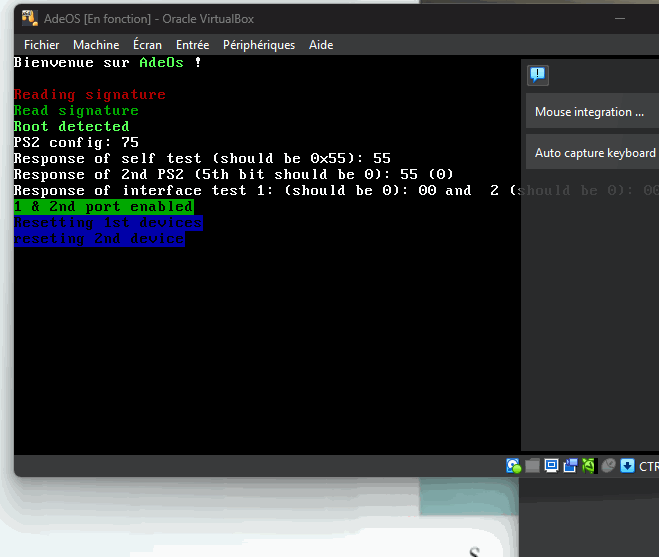

# Message pour mon moi futur
Après plusieurs heures de débug:
On a determiné que l'erreur ne provenais surement pas du linker, mais de la façon dont on charge l'OS en mémoire

Avancée du projet:
-Bootloader ✅: permet de passer du 16bit real mode au 32 bit protected mode puis au 64 bit (en activant l'A20 et en chargeant la GDT etc...) Il y a toujours un petit bug dans le bootloader  
-Base du kernel ✅: Gestion de la mémoire avec la création d'un malloc et d'un free basique, gestion du clavier etc...  
-Système de commandes (utilisant une hashtable) ✅  
-Gestion des IDT  ✅: Gestion des interupts du clavier et du timer (puce PIT) (isq 0 et 1 remap avec le PIC sur les inteupts vecteur 32 33), ainsi que gestion basique des erreurs (div error, double fault)  
-Lecture/ecritude disque: ✅   Tentative d'utiliser un FDC (floppydisk controller) pour lire et écrire le disque. Ne marchais pas très bien.
J'ai décidé d'utiliser un disque dur à la place. La lecture et l'écriture disque fonctionne (avec ATA PIO). Le code doit être nettoyer et s'assurer qu'il ne génére pas d'erreur.
-Ecriture d'un système de fichier: ✅   Le système s'insipire grandement du FAT et commence en 0x10000 dans le fichier kernel.bin
-Driver PS/2 & Souris: ✅   Initialisation correcte du controlleur PS/2: on peut mainteant intéragir avec les led clavier, et utiliser la souris (irq12).
-Ecriture d'un Shell capable d'interagir avec le système de fichier: 🚧 WIP
-Ecriture d'un langage et de son compilateur pour l'utilisateur: 🚧 WIP

Attention pour le compilateur On doit définir une ABI !⚠️:  

Pour simplifier le compilo j'utilise des syscalls pour appeler des fonctions de base (surement print, malloc, et des fonction lecture/ecriture)
int 0x80 (=128) en ref à unix
dans rax le numéro du syscall
le reste depend du syscall mais l'idée sera globalement: 
- soit il utilise quelque registre
- soit il utilise rbx et la pile

rax: description : argument=description
0 : affiche un msg de debug
1 : print : rbx: addresse de la chaine de caractère (todo)

Encore une note:
possibilité d'avoir des commandes compilé dans le file system et de les lancer en chargeant leur fichier en mémoire + en utilisant un handler tout simple (cf. la fonction asm_handler dans Command.cpp) qui gère le passage des arguments du code kernel (en C) à la fonction compilé (en asm)
Cette fonction compilé peut appeler des interupts sytème, et est censé (TODO: test similaire au truc à la fin de Kernel.C) pouvoir appeler d'autre fonction par leur addresse (technique lea + call)

 
Example de la souris (on log aussi les coo):

